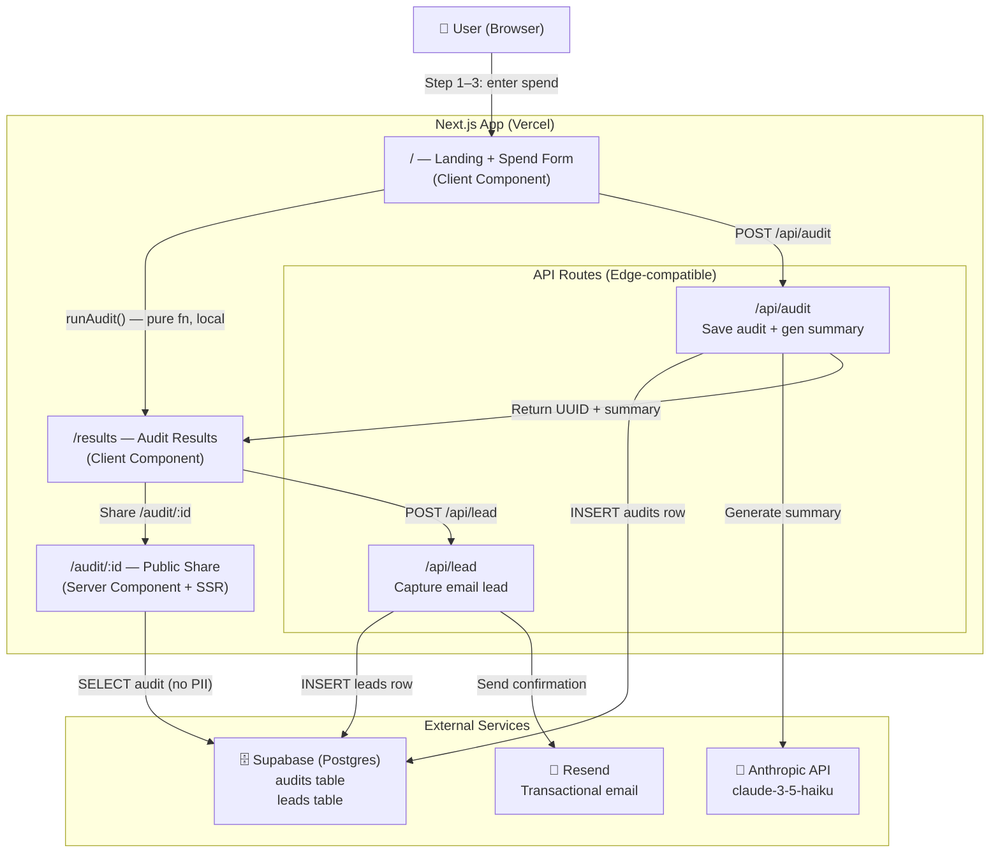

# ARCHITECTURE.md — SpendLens

## System Diagram



---

## Data Flow: Input → Audit Result

```
1. User fills SpendForm (client-side, React state + localStorage)
   ↓
2. "Run Audit" clicked → runAudit(input) called locally (pure TS function)
   ↓  No network call — instant result in browser
3. AuditResult stored in sessionStorage for results page
   ↓
4. Concurrently: POST /api/audit with input + result
   → Supabase INSERT audits row
   → Anthropic API call for 100-word summary (with fallback)
   → Returns { auditId, aiSummary }
   ↓
5. Results page displays with animated savings counter
   → auditId stored for share URL generation
   ↓
6. User optionally submits email → POST /api/lead
   → Supabase INSERT leads row
   → Resend sends branded HTML confirmation
   ↓
7. Share URL: /audit/:id
   → Server component fetches audit row (no leads data)
   → Dynamic OG meta tags rendered server-side for Twitter/Slack previews
```

---

## Why This Stack

| Choice | Why |
|--------|-----|
| **Next.js 14 (App Router)** | SSR for dynamic OG tags on `/audit/:id` — critical for the viral share loop. API routes co-located with frontend. TypeScript native. Zero-config Vercel deploy. |
| **TypeScript** | The audit engine is a domain model with specific constraints (plan IDs, tool IDs, savings tiers). Types catch mistakes at compile time that would otherwise become wrong savings figures in production. |
| **Tailwind CSS** | Assignment explicitly permits it. Fastest path to consistent, responsive design without fighting custom CSS specificity wars. |
| **Supabase** | Free tier Postgres with RLS. Unlike Firebase, gives us proper relational queries and clean PII separation. The `audits` table is public-readable; the `leads` table is service-role-only. |
| **Anthropic API (Haiku)** | Fast (<1s), cheap (<$0.001/audit), good enough for 100-word prose. Falls back gracefully to template if unavailable. |
| **Resend** | Cleanest Next.js email integration. Free tier covers MVP volume. Branded HTML template included. |
| **Vitest** | Jest-compatible but faster. Works with TypeScript + path aliases without extra config. |

---

## Audit Engine Design

The audit engine (`lib/audit-engine.ts`) is intentionally **pure functions with zero side effects**:
- No API calls
- No database reads
- Deterministic output for same input
- Fully unit-testable

This separation is a deliberate architectural choice: the audit logic can be tested in isolation, the UI can render optimistically without waiting for API responses, and the rules can be audited by a non-engineer.

---

## Abuse Protection

| Layer | Mechanism | Documented in |
|-------|-----------|---------------|
| Form | Honeypot field (hidden input `name="website"`) — bots fill it, humans don't | `app/api/lead/route.ts` |
| API | IP-based rate limit: max 3 lead submissions per IP per minute | `app/api/lead/route.ts` |
| Future | Upgrade path: Upstash Redis for distributed rate limiting at scale | Below |

---

## Scaling to 10,000 Audits/Day

Current architecture handles ~1,000 audits/day comfortably on Vercel free tier. To scale to 10k/day:

1. **Rate limiting:** Replace in-memory IP map with Upstash Redis (edge-compatible, distributed across Vercel regions). Cost: ~$10/month.
2. **AI summary queue:** Move Anthropic calls to a background job queue (e.g., Inngest or Trigger.dev) to avoid blocking the audit save API call. Return summary async and update UI via polling or websocket.
3. **Database:** Supabase Pro tier ($25/month) handles 10k+ rows/day easily. Add indexes on `created_at` and `savings_tier` for analytics queries.
4. **Email:** Resend scales linearly. At 10k/day, switch to dedicated domain for deliverability.
5. **CDN:** OG images could be pre-generated and cached via Vercel's Image Optimization rather than served dynamically.
